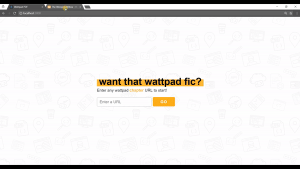

# GrabWatt


Simple web application that allows users to download their preferred Wattpad stories into HTML or PDF format. No logins or software downloads are required. Data will be removed from database after 12 hours.

https://grabwatt.herokuapp.com/

## Demo



## Create your own instance of Grabwatt

Download [NodeJS](https://nodejs.org/en/) and carry out the following commands:

```
git clone https://github.com/andreathniah/grabwatt.git
cd grabwatt
yarn install
cd client
yarn install
cd ..
yarn dev
```

[Google's Firebase Realtime Database](https://firebase.google.com/products/realtime-database/) is required. After the set up, create `.env` files at `/` and `/client` with the appropriate content from Firebase.

```
NODE_ENV=development
REACT_APP_FIREBASE_DOMAIN=
REACT_APP_FIREBASE_KEY=
REACT_APP_FIREBASE_URL=
```

## Build With

- [ExpressJS](https://expressjs.com/) - Backend server used
- [ReactJS](https://reactjs.org/) - Front-end JS library for building UI
- [Firebase](https://firebase.google.com/) - Realtime database used
- [Puppeteer](https://github.com/GoogleChrome/puppeteer) - Headless Chrome Node API
- [jsPDF](https://github.com/MrRio/jsPDF) - Client-side library used for PDF generation
